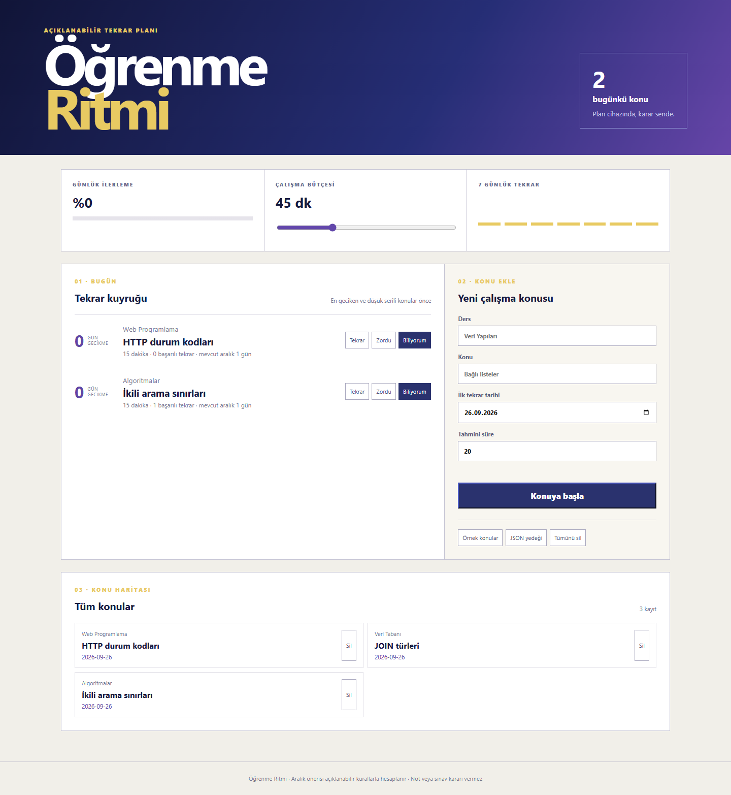

# Öğrenme Ritmi

[](https://github.com/cantsdlnn/ogrenme-ritmi/actions/workflows/ci.yml)

Öğrencinin konu listesini günlük dakika bütçesine sığdıran, tekrar sonucuna göre bir sonraki tarihi açıklanabilir kurallarla hesaplayan yerel-öncelikli PWA.



## Çözdüğü problem

“Bugün ne çalışmalıyım?” sorusu çoğu zaman ya uzun bir listeye ya da nedeni görünmeyen bir öneri motoruna dönüşüyor. Öğrenme Ritmi; vadesi geçmiş konuları, çalışma süresini ve başarı serisini görünür tutar. Kullanıcının verdiği **Tekrar / Zordu / Biliyorum** değerlendirmesi bir sonraki aralığı deterministik olarak değiştirir.

## Özellikler

- Dakika bütçesine göre günlük tekrar kuyruğu
- En eski vade ve düşük başarı serisine öncelik veren kararlı sıralama
- Sonucu ve yeni tarihi birlikte kaydeden tekrar geçmişi
- Yedi günlük etkinlik grafiği ve günlük tamamlanma oranı
- Yerel depolama, JSON yedeği ve çevrimdışı PWA
- Algoritma sınırlarını kapsayan birim testleri ve kapsam eşiği

## Kural özeti

- **Tekrar:** seri sıfırlanır, konu ertesi güne gelir.
- **Zordu:** seri korunur, aralık sınırlı büyür.
- **Biliyorum:** ilk başarılı tekrarda 1 gün, ikincide 3 gün, sonrasında mevcut aralığın yaklaşık iki katı uygulanır.

Bu kurallar öğrenme garantisi değildir; kullanıcı tarafından değiştirilebilir bir başlangıç politikasıdır.

## Çalıştırma

```bash
npm install
npm run dev
npm test
npm run build
```

## AI kullanımı

Üretken yapay zekâyı algoritma alternatiflerini tartışma, sınır durumlarını bulma ve test çeşitlendirme için kullandım. Nihai aralık politikası, veri modeli, kullanıcıya açıklanan sınırlar ve doğrulama sorumluluğu bana aittir. Ayrıntı: [AI_USAGE.md](AI_USAGE.md).

## Lisans

[MIT](LICENSE)
